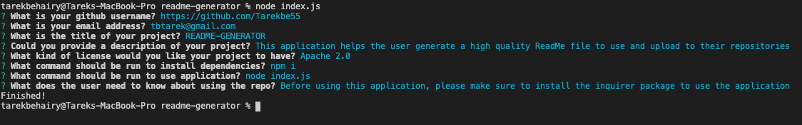
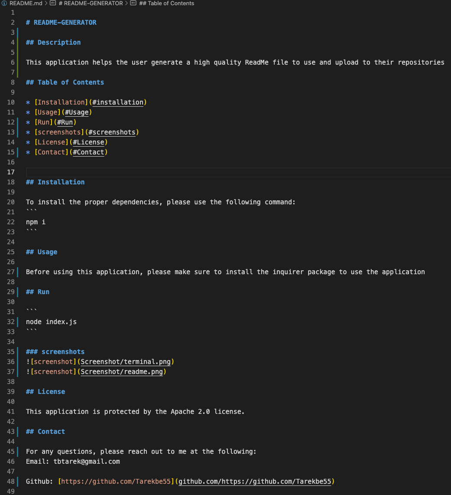

# README-GENERATOR

## Description

This application helps the user generate a high quality ReadMe file to use and upload to their repositories 
  
## Table of Contents

* [Installation](#installation)
* [Usage](#Usage)
* [Run](#Run)
* [screenshots](#screenshots)
* [License](#License)
* [Contact](#Contact)


## Installation

To install the proper dependencies, please use the following command:
```
npm i
```

## Usage

Before using this application, please make sure to install the inquirer package to use the application

## Run

```
node index.js
```

### screenshots



## License

This application is protected by the Apache 2.0 license. 

## Contact

For any questions, please reach out to me at the following:
Email: tbtarek@gmail.com

Github: [https://github.com/Tarekbe55](github.com/https://github.com/Tarekbe55)
